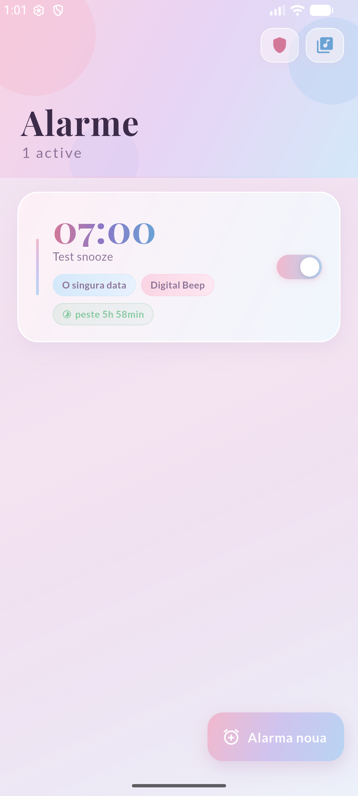
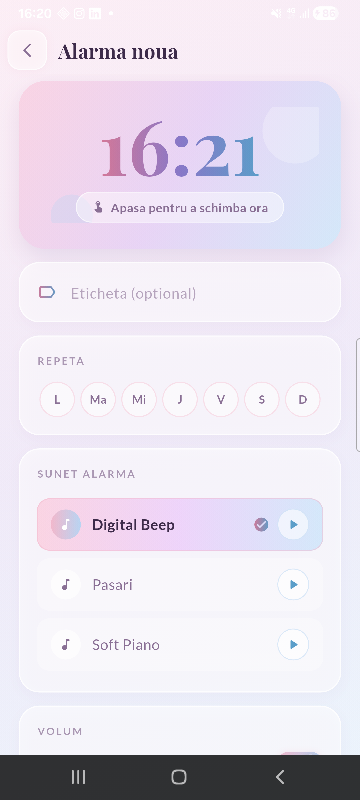
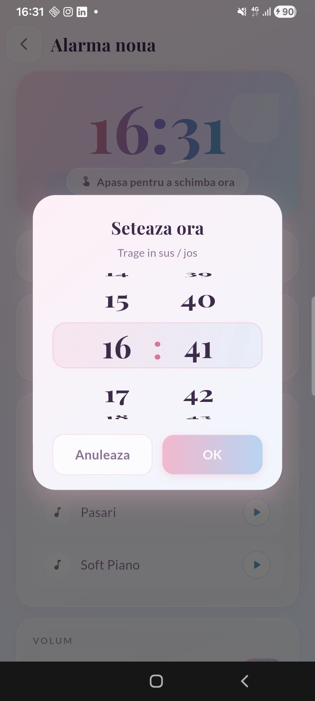
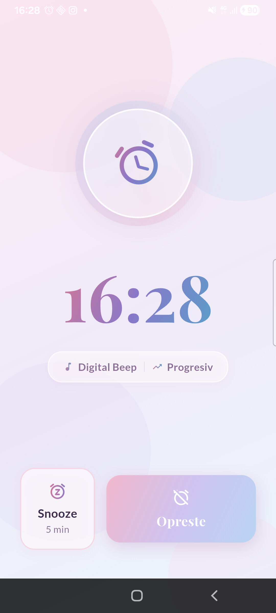
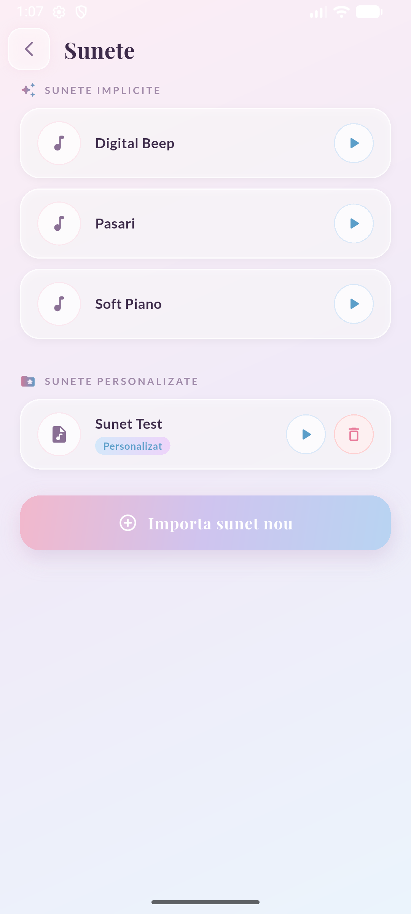

<div align="center">

# ⏰ Alarmă

**Un ceas deșteptător pentru Android care chiar te trezește.**

Construit în Flutter, cu inima în Kotlin nativ — pentru ca sunetul să pornească
și atunci când sistemul preferă să nu te deranjeze.

[](https://flutter.dev)
[](https://kotlinlang.org)
[](https://developer.android.com)
[](#)

</div>

---

## ✨ De ce încă o aplicație de alarmă

Pentru că o alarmă are o singură treabă, iar majoritatea o ratează exact când
contează: telefonul tocmai a repornit, ești într-un apel, sau Android a decis
să economisească baterie. Aplicația asta e construită în jurul acelor cazuri.

<div align="center">

| Lista de alarme | Alarmă nouă | Selector de oră |
|:---:|:---:|:---:|
|  |  |  |

| Ecranul de sonerie | Gestionare sunete |
|:---:|:---:|
|  |  |

</div>

---

## 🎯 Funcții

| | |
|---|---|
| 🔁 | **Repetiție pe zile** — alege exact zilele săptămânii, sau lasă alarma o singură dată |
| 🏷️ | **Etichete** — „Sala", „Medicament", ca să știi ce te-a trezit |
| 😴 | **Snooze configurabil** — 1, 5, 10, 15 sau 30 de minute, per alarmă |
| 📈 | **Volum progresiv** — sunetul crește lin de la zero, pe durata pe care o alegi |
| 🎵 | **Sunete personalizate** — importă orice fișier audio de pe telefon |
| 📞 | **Sună peste apeluri** — rutare pe canalul convorbirii, ca să se audă și în timpul unui apel |
| 🔒 | **Peste ecranul de blocare** — aprinde ecranul și se afișează singură |
| 📳 | **Vibrație** — opțională, separat pentru fiecare alarmă |
| 🔌 | **Supraviețuiește repornirii** — inclusiv **înainte** de prima deblocare a telefonului |
| 🎡 | **Selector de oră cu roată infinită** — fără cadranul de ceas Material |

---

## 🧠 Cum funcționează

Partea interesantă e că **sunetul nu e gestionat de Flutter**.

Când vine ora alarmei, Android pornește un `BroadcastReceiver` nativ, care
lansează un *foreground service* în Kotlin. Serviciul pornește `MediaPlayer`,
ridică volumul, pornește vibrația și postează o notificare *full-screen intent*
care aduce interfața Flutter în față. Flutter desenează doar ecranul.

```
AlarmManager.setAlarmClock
        │
        ▼
  AlarmReceiver ──► AlarmSoundService  ──► 🔊 sunet + 📳 vibrație
        │                   │
        │                   └──► notificare full-screen
        │                                │
        └────────────────────────────────┴──► MainActivity ──► Flutter: ecranul de sonerie
```

Motivul separării: o alarmă trebuie să facă zgomot chiar dacă interfața nu poate
porni. Iar asta se întâmplă mai des decât ai crede — de exemplu imediat după o
repornire, cât timp datele aplicației sunt încă criptate.

### Ce o ține în viață

| Mecanism | La ce folosește |
|---|---|
| `setAlarmClock` | Cea mai mare prioritate în Android, scutită de Doze |
| `LOCKED_BOOT_COMPLETED` + *direct boot* | Rearmează alarmele **imediat** după repornire, fără să aștepte deblocarea |
| Stocare criptată pe dispozitiv | Alarmele pot fi citite înainte de introducerea codului |
| Resincronizare la pornirea aplicației | Recuperează alarmele pierdute după un *Force stop* |
| Rearmare la `TIME_SET`, `TIMEZONE_CHANGED`, schimbarea permisiunii de alarme exacte | Situații în care Android șterge alarmele în tăcere |

---

## 🛠️ Stack

**Flutter · Dart · Kotlin · SQLite**

| Pachet | Rol |
|---|---|
| [`android_alarm_manager_plus`](https://pub.dev/packages/android_alarm_manager_plus) | Programare de rezervă, peste calea nativă |
| [`flutter_local_notifications`](https://pub.dev/packages/flutter_local_notifications) | Notificări full-screen |
| [`sqflite`](https://pub.dev/packages/sqflite) | Baza de date locală a alarmelor |
| [`audioplayers`](https://pub.dev/packages/audioplayers) | Previzualizarea sunetelor |
| [`permission_handler`](https://pub.dev/packages/permission_handler) | Permisiuni de sistem |
| [`file_picker`](https://pub.dev/packages/file_picker) | Import de sunete |
| [`google_fonts`](https://pub.dev/packages/google_fonts) | Playfair Display + Lato |

---

## 🚀 Rulare

```bash
cd alarma
flutter pub get
flutter run -d <id-dispozitiv>
```

Pentru un APK de release:

```bash
flutter build apk --release
# rezultatul: build/app/outputs/flutter-apk/app-release.apk
```

> [!NOTE]
> APK-ul se construiește momentan cu cheia de semnare de **debug**. Pentru
> distribuire reală, configurează o cheie proprie și schimbă `applicationId`
> din `com.example.alarma` în ceva unic.

---

## 🔐 Permisiuni

Aplicația are un ecran dedicat care le explică și le cere pe rând.

| Permisiune | De ce |
|---|---|
| **Notificări** | Fără ea, ecranul de sonerie **nu se deschide** peste blocare |
| **Afișare peste alte aplicații** | Permite lansarea directă a soneriei |
| **Alarme exacte** | Altfel Android poate amâna alarma |
| **Ignorare optimizare baterie** | Împiedică oprirea aplicației în fundal |

> [!IMPORTANT]
> Pe telefoanele **Samsung**, setează în plus bateria aplicației pe
> „Nerestricționat" și scoate-o din „Aplicații adormite". Altfel, sistemul
> poate opri alarmele fără niciun avertisment.

---

## ⚠️ Limitări cunoscute

- După o repornire, **până la prima deblocare** a telefonului, alarma sună și
  afișează notificarea, dar **nu** și ecranul complet — interfața Flutter nu
  poate porni cât timp baza de date e criptată cu codul tău.
- Aplicația este doar pentru **Android**. Mecanismele pe care se bazează
  (`AlarmManager`, foreground services, direct boot) nu au echivalent pe iOS.

---

<div align="center">

Făcută cu ☕ și multe alarme ratate în timpul testelor.

</div>
